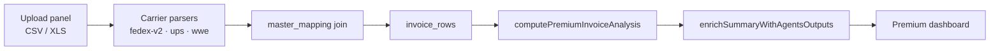

# Invoice Analysis Methodology — Logifacts

## Purpose

This document defines how **Premium Analysis in the Logifacts app** categorizes carrier invoices, computes KPIs, detects anomalies, and surfaces savings. It is the source of truth for agents and engineers working on invoice analysis.

**Scope:** UPS, FedEx, and WWE (WWEX) direct/reseller invoices ingested through the app.  
**Not in app yet:** 3PL invoice + WMS markup (Carrier Type 4 below) — documented for future work only.

**Offline tools:** `scripts/run_invoice_analysis.py` mirrors this logic for local validation; the **app** (`lib/premium-analysis/`) is authoritative.

---

## App pipeline (authoritative)



| Step | Code | What happens |
|------|------|----------------|
| Upload | `app/api/invoices/upload/route.ts` | Detect carrier, parse, map lines, write `invoices` + `invoice_lines`, sync **`invoice_rows`** |
| UPS CSV (legacy) | `invoice_uploads.csv_text` | Full 250-column UPS; synced to `invoice_rows` on analyze |
| Analyze | `app/api/invoices/analyze/route.ts` → `computePremiumInvoiceAnalysis()` | Load facts, filter, summarize, agents layer, cache |
| Read path | `loadPremiumIngestRecords()` | Default: **`invoice_rows`** (`PREMIUM_INGEST_SOURCE=invoice_rows`) |
| Dashboard | `app/components/analysis/premium-dashboard.tsx` | KPIs, charts, `AgentsFindingsPanel`, data health |

Deep technical reference: [`docs/INGEST_ANALYSIS_ROADMAP.md`](./docs/INGEST_ANALYSIS_ROADMAP.md), [`docs/PREMIUM_ANALYSIS_CALCULATION.md`](./docs/PREMIUM_ANALYSIS_CALCULATION.md), [`docs/MAPPING_TAXONOMY_TREE.md`](./docs/MAPPING_TAXONOMY_TREE.md) (category 1–5 explanation tree).

---

## The seven outputs

Every completed Premium Analysis refresh should produce these. They map to persisted summary JSON and the **Agents findings** panel.

| # | Output | App field / UI | Primary module |
|---|--------|----------------|----------------|
| 1 | **Total Spend Summary** | `measures.totalCost`, `monthlySpend`, `byCarrier`, `byService`, `spendByInvoice`, `dailySpend` | `analysis-summary.ts` |
| 2 | **Cost Category Breakdown** | `specCategories` (AGENTS categories + % of total) | `spec-categories.ts` → **Cost structure** card |
| 3 | **Carrier Mix Analysis** | `carrierMix` (shipments, total, avg/shipment by carrier × service × zone mode) | `carrier-mix.ts` → **Carrier mix** card |
| 4 | **Anomaly Flags** | `anomalyFlags[]` with type, tracking, amount, severity | `anomaly-detection.ts` |
| 5 | **Weight Gap Analysis** | `measures.weightGap` (lbs, **shipment grain**) | `shipment-fact.ts` → `shipmentWeightGapLbs()` |
| 6 | **Annualized Savings Estimate** | `savingsEstimate` (low / high, capped vs spend) | `savings-estimator.ts` |
| 7 | **Action Prioritization** | `actionItems[]` (rank, effort, instructions; top 3 `executable`) | `action-prioritization.ts` |

Savings and actions are **hidden** when ingest quality blocks them (`ingestQuality.blockSavings` — unmapped spend > 15% of total by default).

---

## Charge categorization (app)

The app does **not** use a single `categorize(desc)` on every row as the primary path. It uses a **three-tier** resolver in `resolveAgentsCategory()` (`spec-categories.ts`):

1. **`master_mapping`** → `standardized_charge` → AGENTS category (`categoryFromStandardizedCharge`)
2. Else taxonomy **`category_1` / `category_3`** → AGENTS category (`categoryFromTaxonomy`)
3. Else **substring rules on `Charge Description`** (legacy fallback, same intent as original methodology)

### AGENTS charge categories

`BASE_FREIGHT` · `FUEL` · `RESIDENTIAL` · `DELIVERY_AREA` · `PEAK` · `ADD_HANDLING` · `ADDRESS_CORRECTION` · `LARGE_PACKAGE` · `DECLARED_VALUE` · `OTHER`

These roll up into **`specCategories`** for the Cost structure table in the dashboard.

### Dashboard KPI buckets (do not confuse with spec categories)

Legacy KPI cards use **taxonomy Category 3** and UPS classification — overlapping but not identical to `specCategories`:

| KPI | Rule (`analysis-summary.ts`) |
|-----|------------------------------|
| **`fuelCost`** | `category_3 === 'FUEL SURCHARGE'` |
| **`costSurcharges`** | `category_3` ∈ `FUEL SURCHARGE`, `ACCESSORIAL SURCHARGE`, `SURCHARGE` |
| **`costAccessorials`** | UPS `Charge Classification Code === 'ACC'` (excl. INF/ICC), **or** `category_1 === 'ACCESSORIAL SURCHARGE'` with category_3 not in surcharge set |

**Important:** Fuel is a **subset** of surcharges. On FedEx-heavy datasets where only fuel lines map to `FUEL SURCHARGE` at category_3, **`fuelCost` and `costSurcharges` will match**. Accessorial spend (e.g. residential, DAS) often appears only under **`costAccessorials`** or unmapped lines.

**MoM waterfall** (`mom-waterfall.tsx`): must **not** sum Fuel + full Surcharges as separate bridge steps (that double-counts fuel). Use the mutually exclusive partition in `buildMomWaterfallSegments()`:

| Waterfall step | Amount |
|----------------|--------|
| Base Freight | `totalCost − costSurcharges − costAccessorials` |
| Fuel | `costFuel` |
| Other surcharges | `max(0, costSurcharges − costFuel)` |
| Accessorials | `costAccessorials` |

**Money field:** Always **`Net Amount`** (after discounts), never gross invoice amount.

---

## Analytical grain

| Concept | Rule |
|---------|------|
| **Charge line** | One row in `invoice_rows` / `InvoiceRecord` |
| **Shipment** | `shipmentPackageDedupeKey` = `{invoiceNumber}::{tracking or ref1 or lead}` |
| **Weight gap** | Per shipment: `max(billed weight) − max(entered weight)`; summed across shipments (no multi-line double-count) |
| **Carrier mix / expedited flags** | Rolled up via `buildShipmentFacts()` — net counted once per shipment |
| **Savings cap** | Sum of overlapping flag amounts scaled so annualized high ≤ annualized spend |

---

## Universal anomaly flags (implemented)

Checked on every analyze run in `detectAnomalies()`. Types in `agents-types.ts`:

| Flag type | Threshold / trigger | Module helper |
|-----------|---------------------|---------------|
| `fuel_over_eia` | Billed fuel > EIA-published rate by > 0.5pp of transport | `rerateFuelRow()` |
| `accessorial_rate_high` | Accessorials ÷ base freight > 10% | `buildDatasetFlags()` |
| `address_correction` | Mapped address-correction lines with net > 0 | per-line |
| `avoidable_expedited` | Expedited service where ground transit ≤ 3 days | `isAvoidableExpedited()` + `marginalAvoidablePremium()` |
| `weight_gap_high` | Total shipment weight gap > 500 lbs | dataset flag (informational amount 0) |
| `additional_handling` | ADD_HANDLING category, net > 0 | per-line |
| `large_package` | LARGE_PACKAGE, single line > $100 | per-line |
| `declared_value` | DECLARED_VALUE, net > 0 | per-line |
| `monthly_spend_spike` | Month > 20% above prior 3-month rolling average | `detectMonthlySpendSpikes()` |
| `contract_discount_shortfall` | UPS effective discount > 2pp below profile contract | `detectContractDiscountShortfalls()` |

Contract discounts come from **`user.user_metadata.contract_discounts`** (transportation %, etc.).

---

## Carrier Type 1 — UPS

### Ingest formats

| Source | Storage | Notes |
|--------|---------|-------|
| **Billing Center CSV** (250 columns) | `invoice_uploads.csv_text` | Preferred fidelity; Club Colors date filter on analyze |
| **Multipart upload** | `invoices` + `invoice_lines` | Fallback when newer than CSV |

### Key columns (250-column layout)

| Column | Use |
|--------|-----|
| `Invoice Number` / `Invoice Date` | Grouping, monthly trend |
| `Tracking Number` | Shipment dedupe key |
| `Charge Description` | Mapping join |
| `Net Amount` | All spend KPIs |
| `Incentive Amount` | Contract discount shortfall |
| `Billed Weight` / `Entered Weight` | Weight gap |
| `Zone` | Mode / transit / expedited checks |
| `Original Service Description` | Service-level rollups |

### UPS-specific analysis

- **Accessorial detection:** `Charge Classification Code = ACC` drives `costAccessorials` when taxonomy agrees.
- **Contract compliance:** Compare `Incentive Amount / (Net + Incentive)` to contracted transportation discount.

---

## Carrier Type 2 — FedEx

### Ingest format

| Source | Parser | Version |
|--------|--------|---------|
| **Excel invoice (.xls / .xlsx)** | `lib/invoices/parsers/fedex.ts` | **`fedex-v2`** |

Not CSV-from-billingonline in the current app — multipart **Excel** from FedEx Billing Online export.

### Column mapping (fedex-v2, 0-based)

| Field | Column | Maps to |
|-------|--------|---------|
| Bill-to / consolidated account | 1 / 0 | `Account Number` |
| Invoice date / number | 2 / 3 | `Invoice Date`, `Invoice Number` |
| Base freight | Service type (12) + transportation (10) | Base charge line |
| Tracking pairs | Header-anchored from col ~107 | Up to 25 accessorial lines per row |
| Express/Ground tracking ID | Header scan (~col 9) | `Tracking Number` |
| Actual / rated weight | 19 / 21 | `Entered` / `Billed Weight` |
| Shipment / tendered date | 14 / 105 | `Shipment Date`, `Transaction Date` |
| Zone | 64 | `Zone` |

**Dates:** Compact `YYYYMMDD` (e.g. `20241127`) is supported via `parseInvoiceDateKey()`.

### FedEx notes

- Earned discount / contract overlay: **not fully automated** (UPS `Incentive Amount` pattern does not apply uniformly).
- Fuel lines map to `FUEL SURCHARGE` → appear in both **fuel** and **surcharges** KPI buckets.
- DIM divisor reference (139 standard) used in pricing tools; weight gap uses billed vs entered on invoice.

---

## Carrier Type 3 — WWE / WWEX

### Ingest format

| Source | Parser |
|--------|--------|
| **Excel (.xls)** | `lib/invoices/parsers/wwe.ts` |

### App behavior

- Unpivots multiple charge-type columns per airbill row.
- **`datasetFlags.wweFuelEmbedded`**: dashboard shows amber notice — *fuel is embedded in base rates; cannot verify fuel as separate line item* (`agents-findings-panel.tsx`).
- Weekly service charge, additional handling variants: categorized via **`master_mapping`** when mapped; otherwise substring fallback.

### Break-even (~$50K direct UPS)

Not auto-calculated in app; manual interpretation from `measures.totalCost` and annualization.

---

## Carrier Type 4 — 3PL + WMS (not in app)

Markup = 3PL invoice shipping line − WMS `Label Cost` sum. Benchmark 15–25%; flag > 30%.  
**Status:** Planned — no ingest adapter or UI yet. Methodology preserved for future P5.

---

## Ingest quality & operational UX

| Signal | Where | Meaning |
|--------|-------|---------|
| `ingestDiagnostics` | Data health card | Lines mapped, unmapped spend, tracking coverage, parse versions |
| `ingestQuality.blockSavings` | Agents panel | Savings hidden when mapping coverage poor |
| `staleIngest` | Ingest alerts card | Re-upload when `parse_version` missing (e.g. pre–fedex-v2 data) |
| `runRegression` | Ingest alerts card | Large spend/shipment shift vs prior analyze run |

**Re-upload FedEx** after parser upgrades so `invoice_rows` get weights, tracking, and `fedex-v2`.

---

## Environment flags

| Variable | Default | Effect |
|----------|---------|--------|
| `PREMIUM_INGEST_SOURCE` | `invoice_rows` | Read path for analyze |
| `INGEST_QUALITY_BLOCK_SAVINGS` | `1` | Gate savings when unmapped > 15% |
| `INVOICE_ROWS_WRITE` | `1` | Dual-write UPS rows on analyze |

---

## Code reference (app)

| Concern | File |
|---------|------|
| Orchestration | `lib/premium-analysis/compute.ts` |
| Core KPI math | `lib/premium-analysis/analysis-summary.ts` |
| AGENTS layer | `lib/premium-analysis/agents-outputs.ts` |
| Spec categories | `lib/premium-analysis/spec-categories.ts` |
| Shipment facts | `lib/premium-analysis/shipment-fact.ts` |
| Anomalies | `lib/premium-analysis/anomaly-detection.ts` |
| Savings | `lib/premium-analysis/savings-estimator.ts` |
| Actions | `lib/premium-analysis/action-prioritization.ts` |
| FedEx parser | `lib/invoices/parsers/fedex.ts` |
| Mapping table | `master_mapping` (Supabase) |
| Dashboard UI | `app/components/analysis/premium-dashboard.tsx` |
| Findings UI | `app/components/analysis/agents-findings-panel.tsx` |

---

## Automation status

| Priority | Capability | Status |
|----------|------------|--------|
| **P1** | Invoice ingestion (UPS CSV, FedEx/WWE Excel) → `invoice_rows` | ✅ Shipped |
| **P2** | Charge categorization via `master_mapping` + AGENTS resolver | ✅ Shipped |
| **P3** | Seven outputs on every analyze | ✅ Shipped (dashboard + cache) |
| **P4** | Universal anomaly flags | ✅ Shipped |
| **P5** | 3PL markup calculator | ❌ Not started |
| **P6** | Branded PDF findings report | ❌ Not started (dashboard + Excel export instead) |
| **P7** | Contract overlay | ⚠️ Partial (UPS discount shortfall; profile metadata) |

**Target:** Upload → Refresh analysis → dashboard under minutes (depends on row volume and hosting).

---

## Offline validation (non-authoritative)

For local checks against the same math:

```bash
python3 scripts/run_invoice_analysis.py --input-dir "./Invoices skills/FedEx Invoice Example"
```

Requires `pandas`, `openpyxl`, `xlrd`. Output HTML/Excel is for manual review only — **does not replace** the app cache or dashboard.
