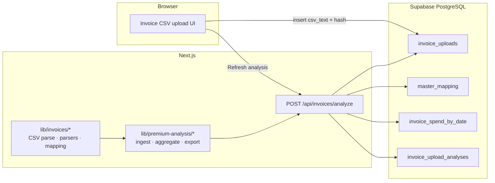

# Logifacts — system architecture

This document describes how the **Premium Analysis** invoice flow fits together: upload, storage, analysis, caching, and how we **prove numeric accuracy** in automated tests.

---

## High-level diagram



**Principle:** raw invoices live in **`invoice_uploads`** / **`invoices`**; dashboard metrics are **derived** and stored in **`invoice_spend_by_date`** (daily rollup) and **`invoice_upload_analyses`** (full JSON summary cache). The **canonical business rules** for those derived values live in **`lib/premium-analysis/`** (pure TypeScript), not in SQL triggers.

---

## Folder structure (invoice domain)

| Location | Role |
|----------|------|
| `app/components/invoices/` | Upload UI (`invoice-csv-upload.tsx`) — client-side parse for row count, dedupe, Supabase insert. |
| `app/api/invoices/analyze/` | `route.ts` — auth, load uploads + mappings, call aggregation engine, write spend + analysis cache. |
| `app/api/invoices/upload/` | Multi-carrier ingest (CSV/Excel) — parses with `lib/invoices/parsers/` and maps lines via **`master_mapping`**. |
| `lib/premium-analysis/` | **Premium Analysis calculation module**: ingest adapters, **`analysis-summary.ts`** aggregation engine, period matrices, Excel export, parse cache. Public entry: `@/lib/premium-analysis`. |
| `lib/invoices/` | **Invoice ingest primitives**: CSV layout (`headers.ts`), parsing/filtering (`csv.ts`), content hash (`dedupe-hash.ts`), carrier parsers, mapping, `invoice_rows` sync. Public entry: `lib/invoices/index.ts`. |
| `lib/invoices/parsers/` | Carrier parsers: **`ups.ts`** (CSV), **`fedex.ts`** / **`wwe.ts`** (Excel via ExcelJS) → `ParsedInvoiceLine[]`. |
| `lib/invoices/mapping.ts` | Joins parsed lines to **`master_mapping`** per carrier (normalized charge description). |
| `lib/invoices/excel-master-mapping.ts` | Reads consolidated mapping **`.xlsx`** (Charge Description … Standardized Charge); used by seed, not by Premium HTTP path. |
| `lib/premium-analysis/analysis-summary.test.ts` | **Accuracy proofs** (Vitest) — same engine as production API. |
| `supabase/seed.ts` | Upserts **`master_mapping`** from the workbook (see below). |
| `Invoices skills/` | **Offline** consolidated mapping workbook (`Master_Mapping_Consolidated_Updated*.xlsx`) + optional Python tooling — seeding source, not read on every analyze request. |

---

## End-to-end process

### 1. Upload (`invoice_uploads`)

1. User selects one or more UPS-style CSV files (250-column layout; see `lib/invoices/headers.ts`).
2. Client reads file text, runs `parseInvoiceCsvText` to ensure rows parse and to compute **`row_count`**.
3. **Dedupe before insert**
   - **Same file name** already stored for this user (or duplicated in the batch) → skip.
   - **Same normalized content** (SHA-256 of normalized text; see `dedupe-hash.ts`) → skip, even if the file name differs (“duplicate folder” uploads).
4. Successful files are inserted with `user_id`, `original_file_name`, `csv_text`, `row_count`, `content_sha256`, `status`.
5. **Automatic analyze** — After a successful insert, the upload UI calls **`POST /api/invoices/analyze`** and dispatches a browser event so **`PremiumDashboard`** refreshes without a separate “analyze” button. Manual full recompute is **Refresh analysis** on the dashboard only.

Row-level **Sender Company Name** in storage is still whatever the carrier export contained; see analysis step for the user-profile override.

### 2. Analyze (`POST /api/invoices/analyze`)

1. **Authenticate** — Supabase session required.
2. **Load uploads** for the user (bounded batch, ordered by recency).
3. **Backfill `content_sha256`** when missing (legacy rows) using `dedupe-hash-server.ts` so future dedupe stays consistent.
4. **Parse & normalize rows**
   - `parseInvoiceCsvText` on each upload’s `csv_text`.
   - `filterRowsLikeClubColorsPowerQuery` — aligns with the Power Query–style filter (drop invalid/system rows).
   - `applyProfileSenderCompanyName` — if `user.user_metadata.company_name` is set, every row’s `Sender Company Name` is replaced for reporting consistency.
5. **Load mappings** from **`master_mapping`** (including **`carrier`** and **`standardized_charge`**) and build **`buildChargeDescriptionLookup`**: composite keys are **`UPS` / `FEDEX` / `WWE` + tab + normalized charge description**, plus legacy **description-only** keys for **UPS** rows for backward compatibility.
6. **Aggregate** with `computeInvoiceAnalysisSummary` in `lib/premium-analysis/analysis-summary.ts` — **single source of truth** for totals, fuel/accessorial splits, carrier/service, daily/monthly spend, category/mode/weight buckets, package dedupe by shipment key, weight gap, etc. Row-level taxonomy resolution uses **`Carrier Name`** from the CSV plus **`Charge Description`** (see [`PREMIUM_ANALYSIS_CALCULATION.md`](./PREMIUM_ANALYSIS_CALCULATION.md)).
7. **Persist results**
   - Replace user rows in `invoice_spend_by_date` from the computed daily series.
   - Upsert `invoice_upload_analyses` (summary JSON, keyed by latest `invoice_upload_id` while values aggregate across uploads in that run).

### 3. Read path (dashboard)

Premium Analysis UI loads cached analysis and/or recomputes display from stored JSON spend — implementation lives under `app/components/analysis/` and calls `GET`/`POST` `/api/invoices/analyze` as wired today.

---

## Accuracy proofs (testing strategy)

**Goal:** Production numbers must match a **tested, deterministic** implementation, not an ad hoc copy in the route handler.

| Mechanism | Details |
|-----------|---------|
| **Pure engine** | `computeInvoiceAnalysisSummary` has **no** database or network calls. |
| **Co-located tests** | `lib/premium-analysis/analysis-summary.test.ts` runs with **Vitest** (`pnpm test`). |
| **Golden-style cases** | Synthetic rows with hand-checked expectations for `totalCost`, `fuelCost`, `costAccessorials`, package dedupe, etc. |
| **Pipeline smoke** | Full 250-column CSV line → parse → filter → profile sender. |

**How to extend proofs for a “real product”:** add a **redacted real CSV snippet** under `lib/invoices/fixtures/` (or similar) and assert expected measures using a **frozen subset** of **`master_mapping`** taxonomy rows (**include `carrier`** when asserting multicarrier behavior), or a signed-off JSON expected summary from finance/Power BI.

---

## Technology choices (invoice path)

| Concern | Choice |
|---------|--------|
| **Runtime for business logic** | **TypeScript** (`lib/invoices`) in the Next.js server. |
| **Persistence & auth** | **Supabase** (Postgres + RLS + Auth `user_metadata.company_name`). |
| **Python** | Optional for **download/ETL** under `Invoices skills/` — **not** required for the standard in-app upload → analyze loop. |

---

## Taxonomy table (`master_mapping`)

Single canonical reference for multicarrier charge-description taxonomy:

| Table | Used by | Role |
|-------|---------|------|
| **`master_mapping`** | Premium Analysis (`computePremiumInvoiceAnalysis`), multipart upload mapping (`mapInvoiceLines`), manual fixes (`POST /api/invoices/mapping`) | Columns: **`charge_description`**, **`carrier`**, **`standardized_charge`**, **`transportation_mode`**, **`category_1`…`category_5`**. Grain: **`UNIQUE (carrier, charge_description)`**. |

Seeded from the consolidated Excel workbook via **`pnpm dlx tsx supabase/seed.ts`**: optional **`MASTER_MAPPING_XLSX`**, otherwise **`Invoices skills/Master_Mapping_Consolidated_Updated_3.xlsx`** if present, else **`…Updated.xlsx`**. Older migrations may have altered legacy table names before consolidation; applied history lives under **`supabase/migrations/`**.

### Seeding taxonomy (`master_mapping`)

Canonical one-liner (from repo root, after migrations are applied):

```bash
pnpm dlx tsx supabase/seed.ts
```

**Environment** (required by `supabase/seed.ts`):

| Variable | Notes |
|----------|--------|
| **`SUPABASE_URL`** or **`NEXT_PUBLIC_SUPABASE_URL`** | Project API URL (e.g. `https://<project-ref>.supabase.co`). |
| **`SUPABASE_SERVICE_KEY`** | **Prefer for DB upserts** (service role). The script accepts `NEXT_PUBLIC_SUPABASE_PUBLISHABLE_KEY` as a fallback, but anon/publishable keys may hit RLS limits—use service role when refreshing mappings in staging/production. |

**Optional:**

| Variable | Notes |
|----------|--------|
| **`MASTER_MAPPING_XLSX`** | Absolute or relative path to the consolidated workbook if you do not want the default resolver under `Invoices skills/`. |

**Example** (explicit workbook + prod URL — do not paste real keys into git):

```bash
export SUPABASE_URL="https://YOUR_PROJECT_REF.supabase.co"
export SUPABASE_SERVICE_KEY="your-service-role-key"
export MASTER_MAPPING_XLSX="Invoices skills/Master_Mapping_Consolidated_Updated.xlsx"

pnpm dlx tsx supabase/seed.ts
```

The script logs which workbook path it reads, then chunked upserts into **`master_mapping`**. Row count after seed depends on workbook rows that survive dedupe by **`(carrier, charge_description)`** (expect on the order of **~245** rows for the current consolidated file, not necessarily every raw Excel row).

---

## Operational notes

- **`master_mapping` stays in lockstep with the Master Mapping workbook** — the table is the **only canonical** taxonomy source at runtime (`carrier` + `charge_description` → categories, modes, standardized charge labels). **`pnpm dlx tsx supabase/seed.ts`** is not a one-time setup step: **re-run it against production whenever the consolidated Excel gains new carriers, charge descriptions/types, or category changes**, after pointing env at the correct project (`SUPABASE_URL`, **`SUPABASE_SERVICE_KEY`**) and, if needed, **`MASTER_MAPPING_XLSX`** (see **Seeding taxonomy** below). Missing a seed after a workbook rollout desynchronizes classifications from what finance expects.
- **Re-run analysis** whenever new files are uploaded; the API aggregates over the current batch of uploads (subject to the route’s limit).
- **Mapping changes** in **`master_mapping`** affect Premium Analysis on the next analyze and structured **`invoice_lines`** after re-upload or remap (`POST /api/invoices/mapping`). For auditability, consider versioning mappings or storing a `mapping_revision` on analysis records (future enhancement).

---

## Related commands

```bash
pnpm test   # accuracy proofs (Vitest)
pnpm build  # production compile check

# Required after every Master Mapping Excel update (Operational notes above)
pnpm dlx tsx supabase/seed.ts
```

For Next.js and framework conventions, follow `AGENTS.md` and the local Next.js docs referenced there.
