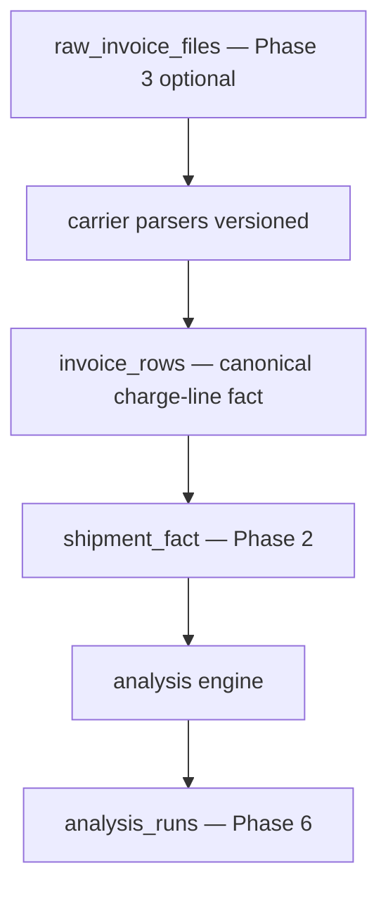

# Ingest & Analysis Roadmap

Reference for unifying invoice ingestion, fixing analytical grain, and making data quality visible before surfacing savings opportunities.

**Status:** Sprints S1–S6 implemented in code.  
**Last updated:** 2026-06-14

---

## Problem statement

Today two ingest paths feed one analysis engine:

| Path | Storage | Fidelity |
|------|---------|----------|
| UPS CSV | `invoice_uploads.csv_text` | Full 250-column layout |
| FedEx / WWE multipart | `invoices` + `invoice_lines` | Narrow schema → lossy projection into `InvoiceRecord` |

Multipart projection drops weights, accounts, and mapping metadata. Metrics mix **charge-line** and **shipment** grain. Savings estimates can exceed total spend when detection logic over-counts (partially fixed 2026-06-11).

---

## Target architecture

**Read-path rule (Phase 3):** `loadPremiumIngestRecords` prefers `invoice_rows`; legacy adapters remain as fallback during migration.

---

## Sprint plan

| Sprint | Scope | User-visible outcome |
|--------|-------|----------------------|
| **S1** ✅ | Phase 0 + Phase 1.1–1.3 | FedEx weights/accounts; facts in `invoice_rows`; data health card; golden CI |
| **S2** | Phase 2 + savings hardening | Shipment-grain anomalies; credible expedited flags ✅ |
| **S3** | Phase 3 + Phase 4 | Unified read path; ingest quality gates ✅ |
| **S4** | Phase 5 + Phase 6 start | Faster refresh; marginal expedited premium ✅ |
| **S5** | Phase 6 completion | Run regression; re-upload banner; ingest source UX ✅ |
| **S6** | Phase 3 cutover | `invoice_rows` default read path; raw file retention; legacy deprecated ✅ |

---

## S1 — Implemented

### Canonical charge-line contract

- **Version constants:** `lib/invoices/charge-line-contract.ts`
  - `CANONICAL_CHARGE_LINE_VERSION = '1'`
  - `FEDEX_PARSE_VERSION = 'fedex-v2'`
- **Extended `ParsedInvoiceLine`:** account, weights, transaction date, package qty, parse version
- **Extended diagnostics:** `lib/premium-analysis/ingest-diagnostics.ts`
  - `linesTotal`, `linesMapped`, `unmappedSpend`, `shipmentsTotal`, `shipmentsWithoutTracking`, `linesMissingShipDate`, `parseVersions`

### FedEx parser enrichment

File: `lib/invoices/parsers/fedex.ts`

Header-driven columns (with fallbacks from golden fixture):

| Field | Column (0-based) |
|-------|------------------|
| Bill to Account | 1 |
| Consolidated Account | 0 (fallback) |
| Actual Weight | 19 |
| Rated Weight | 21 |
| Number of Pieces | 23 |
| Shipment Date | 14 |
| Tendered Date | 105 (transaction fallback) |

Weights map to analysis as: **Billed = Rated Weight**, **Entered = Actual Weight** (DIM convention).

### Fact table writes

- Migration: `supabase/migrations/20260612100000_ingest_s1_invoice_facts.sql`
  - `invoice_lines`: `account_number`, `billed_weight`, `entered_weight`, `transaction_date`, `parse_version`
  - `invoice_rows`: `mapped`, `standardized_charge`, `category_1`–`category_3`, `parse_version`, `shipment_date`
- Upload always syncs `invoice_rows` (multipart path)
- Taxonomy denormalized at ingest into `invoice_rows`
- `invoice_lines` + adapter projection carry weights into analyze path

### Data health UX

- Component: `app/components/analysis/data-health-card.tsx`
- Wired in `premium-dashboard.tsx` when `ingestDiagnostics` present

### Golden tests

- `lib/premium-analysis/golden-ingest.test.ts` — FedEx fixture: packages, weights, savings cap
- `lib/invoices/parsers/fedex-header-scan.test.ts` — column index regression guard

---

## S2 — Implemented

New module: `lib/premium-analysis/shipment-fact.ts`

- `buildShipmentFacts()` — rolls charge lines to one row per `shipmentPackageDedupeKey`
- `shipmentWeightGapLbs()` — max billed − max entered per shipment (no multi-line double-count)
- `totalShipmentNet()` / `totalPackageCount()` — shipment-grain aggregates

### Wired consumers

| Module | Change |
|--------|--------|
| `anomaly-detection.ts` | Expedited + fuel rerate use shipment facts; weight-gap flag is informational (`amount: 0`) |
| `carrier-mix.ts` | `shipmentNet` counted once per shipment |
| `agents-outputs.ts` | Overrides `measures.weightGap` with shipment-based gap; passes facts to carrier mix |
| `savings-estimator.ts` | `capFlagAmountsBySpend()` scales overlapping flag totals before annualization |

**Exit criteria:** `sumDollarFlagAmounts(flags) ≤ totalCost` — covered by `shipment-fact.test.ts` and `golden-ingest.test.ts`.

---

## S3 — Implemented

### Unified read path

- **Adapter:** `lib/premium-analysis/ingest-adapters/invoice-rows.ts` — paginated `invoice_rows` → `InvoiceRecord[]`
- **Registry:** `loadPremiumIngestRecords()` in `ingest-adapters/index.ts`
  - `PREMIUM_INGEST_SOURCE=auto` (default) — use `invoice_rows` when shadow parity ≤ 0.1% vs legacy; else legacy
  - `invoice_rows` — facts only (errors if empty)
  - `legacy` — per-carrier adapters (pre-S3 behaviour)

### Shadow compare

- `shadowCompareIngestTotals()` in `lib/premium-analysis/ingest-quality.ts`
- Logs mismatch when `|factsTotal − legacyTotal| / max(total) > 0.1%`

### Ingest quality gates

- `evaluateIngestQuality()` — blocks savings when `unmappedSpend / totalCost > 15%`
- `INGEST_QUALITY_BLOCK_SAVINGS=0` disables gating
- Wired in `compute.ts`; savings/actions stripped from summary when blocked
- UI: amber notice in `agents-findings-panel.tsx`

**Exit criteria:** `s3-ingest.test.ts` — row mapping, shadow parity, quality gate.

---

## S4 — Implemented

- **Batch analyze:** `invoice-upload-panel.tsx` uploads all files first, then one `POST /api/invoices/analyze`
- **Redis parse cache:** `lib/cache/parse-ingest-cache.ts` + async L1/L2 in `analyze-parse-cache.ts`; invalidated on upload
- **FedEx transit:** `lib/premium-analysis/fedex-transit-table.ts`; carrier-aware `transit-table.ts`
- **Marginal expedited premium:** `lib/premium-analysis/expedited-marginal.ts` — avoidable flag uses list-rate delta vs Ground, not full base freight
- **`analysis_runs` table:** migration `20260613100000_analysis_runs.sql`; `recordAnalysisRun()` on each analyze POST

**Exit criteria:** `s4-performance.test.ts`

---

## S5 — Implemented

- **Run regression:** `analysis-regression.ts` + `fetchLatestAnalysisRuns()` — compares current refresh to prior `analysis_runs` row (>5% spend/shipment shift warns)
- **Stale ingest detection:** `stale-ingest.ts` — banner when carrier data lacks current `parse_version` (e.g. `fedex-v2`)
- **Dashboard:** `ingest-alerts-card.tsx` — read path badge, re-upload reasons, regression notice
- Wired on unfiltered `POST /api/invoices/analyze` before cache persist

**Exit criteria:** `s5-operational.test.ts`

---

## S6 — Implemented

- **Default read path:** `PREMIUM_INGEST_SOURCE` defaults to `invoice_rows` (was `auto`)
- **Bootstrap:** `invoice-rows-bootstrap.ts` backfills facts from `invoice_uploads` CSV and multipart `invoice_lines` when `invoice_rows` is empty
- **Legacy deprecation:** `PREMIUM_INGEST_ADAPTERS` marked deprecated; `legacy` / `auto` log warnings; dashboard shows legacy notice in `ingest-alerts-card.tsx`
- **Raw file retention:** `raw_invoice_files` table + `retainRawInvoiceFile()` on multipart upload when `RAW_INVOICE_FILES_RETAIN=1` (payload ≤ 8 MiB)

**Exit criteria:** `s6-ingest.test.ts`

---

## Schema migrations (cumulative)

| Migration | Purpose |
|-----------|---------|
| `20260612100000_ingest_s1_invoice_facts.sql` | S1 taxonomy + weights on facts |
| `20260613100000_analysis_runs.sql` | S4 analyze audit trail |
| `20260614100000_raw_invoice_files.sql` | S6 optional multipart byte retention |

**Do not drop** `invoices` / `invoice_lines` — writes continue at upload; reads use `invoice_rows`.

---

## Feature flags

| Env | Default | Purpose |
|-----|---------|---------|
| `INVOICE_ROWS_WRITE` | `1` | UPS analyze-time sync |
| `PREMIUM_INGEST_SOURCE` | `invoice_rows` | Facts read path (`legacy` / `auto` for rollback) |
| `INGEST_QUALITY_BLOCK_SAVINGS` | `1` | Hide savings when mapping poor |
| `RAW_INVOICE_FILES_RETAIN` | `0` | Store multipart bytes in `raw_invoice_files` |

---

## Rollout controls

| Risk | Mitigation |
|------|------------|
| Dashboard number shift | Shadow mode in S3 before cutover |
| Parser version change | `parse_version` on rows; re-upload banner |
| `row_hash` change | Tracking included in multipart hash (S1) |
| Cold-start parse cache miss | Redis cache in S4 |

---

## Re-upload requirement

After S1 deploy, **re-upload FedEx files** so:

1. `invoice_lines` get weights + account
2. `invoice_rows` get taxonomy columns
3. Weight gap KPI populates

Old rows lack `reference_1` tracking if uploaded before the FedEx tracking fix.

---

## Related docs

- [`ARCHITECTURE.md`](./ARCHITECTURE.md) — live pipeline
- [`PREMIUM_ANALYSIS_AUDIT.md`](./PREMIUM_ANALYSIS_AUDIT.md) — calculation audit
- [`DATABASE.md`](./DATABASE.md) — table reference
- [`AGENTS Invoices.md`](../AGENTS%20Invoices.md) — business rules
