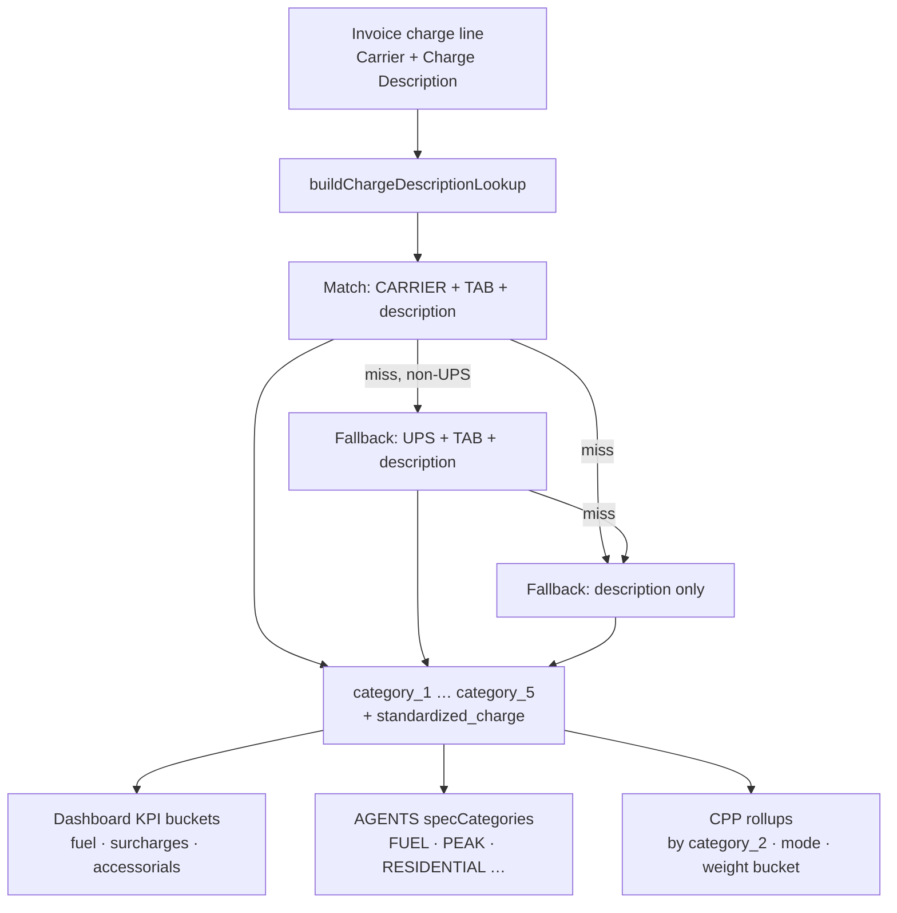

# Master mapping taxonomy — explanation tree

How **`master_mapping`** classifies carrier charge lines today, and how each level connects to Premium Analysis KPIs, AGENTS categories, and dashboard visuals.

**Source file (local):** `Invoices skills/Master_Mapping_Consolidated_Updated.xlsx`  
**Database table:** `public.master_mapping` (seeded / upserted from the same workbook)  
**Row count:** 268 charge-description mappings across **UPS** (215), **FedEx** (30), **WWE** (23)

Related docs: [`AGENTS Invoices.md`](../AGENTS%20Invoices.md) · [`PREMIUM_ANALYSIS_CALCULATION.md`](./PREMIUM_ANALYSIS_CALCULATION.md)

---

## How a charge line gets its categories



**Join key:** trimmed, uppercased **Charge Description** (+ carrier-aware composite key).  
**Code:** `buildChargeDescriptionLookup()` / `lookupChargeTaxonomy()` in `lib/premium-analysis/analysis-summary.ts`.

If no row matches → categories are empty; CPP rollups label the row **`UNMAPPED`**.

---

## What each level means

| Level | Column | Role | Think of it as… |
|-------|--------|------|-----------------|
| **1** | `category_1` | Top spend family | “What kind of money is this?” — base transport, fuel, accessorial-style surcharge, or penalty/admin |
| **2** | `category_2` | Charge type (dashboard CPP) | “Which charge group?” — used for **Spend by charge type — volume & CPP** |
| **3** | `category_3` | **KPI engine switch** | Drives **`fuelCost`**, **`costSurcharges`**, and part of accessorial logic |
| **4** | `category_4` | Service / surcharge sub-type | Ground vs Next Day, Peak Season vs Demand, Delivery Area vs Residential, etc. |
| **5** | `category_5` | Fine-grained product label | Commercial vs Residential variant, correction type, void, GSR, etc. |
| — | `standardized_charge` | Canonical charge name | Used first by **AGENTS Cost structure** (`resolveAgentsCategory`) |
| — | `carrier` | UPS · FedEx · WWE | Composite lookup: `FEDEX\tFUEL SURCHARGE` vs shared UPS wording |
| — | `transportation_mode` | Parcel · Other · … | Metadata; not a primary KPI splitter today |

**Important:** There is **no** single mapping value named **“Surcharges”**. Surcharge-like spend is spread across **`Accessorial Surcharge`** (Category 1), many Category 2 labels (`Peak/Demand`, `Area Surcharge`, …), and Category 3 values (`Surcharge`, `Accessorials`, `Fuel Surcharge`).

---

## Category 1 — top of the tree (4 values)

```
master_mapping (Category 1)
├── Accessorial Surcharge   (60 rows)   … delivery area, residential, handling, peak, etc.
├── Base Freight            (103 rows)  … linehaul / service transport
├── Fuel Surcharge          (10 rows)   … fuel lines only
└── Other / Penalties       (95 rows)   … adjustments, voids, GSR, large package penalties, returns fees
```

---

## Full taxonomy tree (Category 1 → 2 → 3 → 4)

Category 5 is omitted here for readability (51 distinct fine labels). See [Category 4 & 5](#category-4--5-detail-layer) below.

### Accessorial Surcharge

```
Accessorial Surcharge
├── Area Surcharge
│   ├── Accessorials → Delivery Area, Remote Area
│   ├── Base Freight → Returns
│   └── Other / Penalties → Delivery Area
├── Express Premium
│   └── Accessorials → Express
├── Handling
│   ├── Accessorials → Handling & Size
│   └── Other / Penalties → Handling & Size
├── Miscellaneous
│   └── Accessorials → Other Unclassified
├── Other Admin
│   ├── Accessorials → Delivery Area, Residential
│   └── Other / Penalties → Handling & Size
├── Peak/Demand
│   └── Surcharge → Demand, Peak Season          ← non-fuel surcharge KPI (category_3 = SURCHARGE)
├── Residential Surcharge
│   ├── Accessorials → Residential
│   └── Base Freight → Returns
└── Signature
    └── Accessorials → Other Unclassified
```

### Base Freight

```
Base Freight
├── Base Freight
│   └── Base Freight → 2nd Day Air, 3 Day Select, Ground, Next Day Air, Returns, …
├── International
│   ├── Accessorials → Residential
│   └── Base Freight → International, Worldwide
├── LTL / Hundredweight
│   └── LTL Freight → LTL (Hundredweight)
└── Other Admin
    └── Base Freight → per-service corrections (Address Correction, Zone Adjustment, …)
```

### Fuel Surcharge

```
Fuel Surcharge
├── Fuel Surcharge
│   └── Fuel Surcharge → Fuel Surcharge, Returns
└── Other Admin
    └── Fuel Surcharge → Fuel Surcharge (address correction / adjustment fuel lines)
```

All fuel rows end with **Category 3 = `Fuel Surcharge`** (normalizes to `FUEL SURCHARGE` in code).

### Other / Penalties

```
Other / Penalties
├── Large Package
│   └── Other / Penalties → Handling & Size
├── Miscellaneous
│   └── Other / Penalties → Address Errors, Other Unclassified, …
├── Other Admin
│   ├── Accessorials → Adjustments, Other Unclassified
│   └── Other / Penalties → Address Errors, Adjustments, Documentation, Service Fees, …
├── Peak/Demand
│   └── Other / Penalties → Handling & Size, Other Unclassified
├── Residential Surcharge
│   └── Other / Penalties → Other Unclassified
└── Returns
    ├── Base Freight → Returns
    └── Other / Penalties → Returns
```

---

## Category 3 — KPI engine (6 values)

After `normalizeMappingText()` (trim + uppercase), Category 3 is compared to fixed sets in `analysis-summary.ts`:

| Category 3 (mapping) | Normalized | Dashboard KPI | Notes |
|----------------------|------------|---------------|-------|
| `Fuel Surcharge` | `FUEL SURCHARGE` | **`fuelCost`** + **`costSurcharges`** | Fuel is a **subset** of surcharges |
| `Surcharge` | `SURCHARGE` | **`costSurcharges`** only | e.g. Peak/Demand rows |
| `Accessorials` | `ACCESSORIALS` | Usually **`costAccessorials`** (not `costSurcharges`) | Via `isAccessorialCostRow()` when `category_1 = ACCESSORIAL SURCHARGE` |
| `Base Freight` | `BASE FREIGHT` | Contributes to total cost; not fuel/surcharge/accessorial KPI | |
| `LTL Freight` | `LTL FREIGHT` | Same | Hundredweight / LTL |
| `Other / Penalties` | `OTHER / PENALTIES` | Often accessorial or unclassified spend | |

### KPI rules (code)

| Measure | Rule |
|---------|------|
| **`fuelCost`** | `category_3 === 'FUEL SURCHARGE'` |
| **`costSurcharges`** | `category_3 ∈ { FUEL SURCHARGE, ACCESSORIAL SURCHARGE, SURCHARGE }` |
| **`costAccessorials`** | UPS `Charge Classification Code === 'ACC'` (excl. INF/ICC), **or** `category_1 === 'ACCESSORIAL SURCHARGE'` with `category_3` **not** in the surcharge set above |

**Money field:** always **`Net Amount`**.

---

## Category 2 → dashboard CPP chart

The **Spend by charge type — volume & CPP** panel groups by **Category 2** (14 distinct values):

| Category 2 | Typical Category 1 parents | What users see |
|------------|---------------------------|----------------|
| Base Freight | Base Freight | Core transport |
| Fuel Surcharge | Fuel Surcharge | Fuel (also in Surcharges KPI) |
| Peak/Demand | Accessorial Surcharge, Other / Penalties | Peak / demand fees |
| Area Surcharge | Accessorial Surcharge | DAS / extended / remote |
| Residential Surcharge | Accessorial Surcharge, Other / Penalties | Residential delivery |
| Handling | Accessorial Surcharge | Additional handling / DIM |
| Express Premium | Accessorial Surcharge | Express surcharges |
| International | Base Freight | International transport |
| LTL / Hundredweight | Base Freight | Hundredweight |
| Large Package | Other / Penalties | Oversize |
| Returns | Other / Penalties | Return charges |
| Signature | Accessorial Surcharge | Signature fees |
| Miscellaneous | Accessorial Surcharge, Other / Penalties | Catch-all |
| Other Admin | All families | Corrections, voids, adjustments on various bases |

**CPP formula:** `totalCost ÷ totalVolume` where volume = sum of `max(1, Package Quantity)` per charge line in that bucket.

---

## Category 4 & 5 (detail layer)

**Category 4** (20 values) — service or surcharge mechanism:

`2nd Day Air` · `3 Day Select` · `Ground` · `Next Day Air` · `International` · `LTL (Hundredweight)` · `Delivery Area` · `Remote Area` · `Residential` · `Peak Season` · `Demand` · `Handling & Size` · `Fuel Surcharge` · `Returns` · `Adjustments` · `Address Errors` · `Documentation` · `Service Fees` · `Express` · `Other Unclassified`

**Category 5** (51 values) — commercial vs residential, correction subtype, void, GSR, etc.  
Examples: `Ground Commercial`, `Next Day Air Residential`, `Address Correction`, `Fuel`, `Weekly Service`.

These levels are persisted on `invoice_rows` and exported to Excel; they are **not** the primary drivers of fuel/surcharge KPI splits (Category 3 is).

---

## AGENTS Cost structure (separate from Category 2)

The **Cost structure** card uses `resolveAgentsCategory()` (`lib/premium-analysis/spec-categories.ts`):

1. **`standardized_charge`** → regex map to AGENTS category  
2. Else **`category_1` / `category_3`** taxonomy hints  
3. Else substring rules on **Charge Description**

| AGENTS category | Typical mapping signals |
|-----------------|-------------------------|
| `BASE_FREIGHT` | Base transport, Ground, Next Day, etc. |
| `FUEL` | `category_3 = Fuel Surcharge`, or “fuel” in standardized charge |
| `RESIDENTIAL` | Residential Surcharge, residential labels |
| `DELIVERY_AREA` | Area Surcharge, DAS, remote |
| `PEAK` | Peak/Demand + `category_3 = Surcharge` |
| `ADD_HANDLING` | Handling category_2 |
| `ADDRESS_CORRECTION` | Address correction / address errors |
| `LARGE_PACKAGE` | Large Package |
| `DECLARED_VALUE` | From charge description fallback |
| `OTHER` | Unmapped or uncategorized |

AGENTS categories and Category 2 CPP buckets **overlap but are not identical**.

---

## Row-count reference (Category 1 → 2 → 3)

Sorted by volume of mapping rows (not invoice spend):

| Rows | Category 1 → Category 2 → Category 3 |
|------|----------------------------------------|
| 65 | Base Freight → Base Freight → Base Freight |
| 48 | Other / Penalties → Other Admin → Other / Penalties |
| 24 | Base Freight → Other Admin → Base Freight |
| 24 | Other / Penalties → Miscellaneous → Other / Penalties |
| 14 | Accessorial Surcharge → Area Surcharge → Accessorials |
| 8 | Accessorial Surcharge → Handling → Other / Penalties |
| 7 | Other / Penalties → Other Admin → Accessorials |
| 7 | Base Freight → LTL / Hundredweight → LTL Freight |
| 6 | Accessorial Surcharge → Peak/Demand → **Surcharge** |
| 6 | Accessorial Surcharge → Residential Surcharge → Accessorials |
| 6 | Fuel Surcharge → Fuel Surcharge → **Fuel Surcharge** |
| 6 | Base Freight → International → Base Freight |
| 6 | Other / Penalties → Peak/Demand → Other / Penalties |
| … | (see workbook for full list) |

---

## MoM waterfall buckets (dashboard hover)

The **What Drove the MoM Change?** chart uses a **mutually exclusive** four-step partition (fuel is not double-counted with surcharges). Hover text is sourced from `lib/premium-analysis/waterfall-bucket-taxonomy.ts` (kept in sync with this doc).

| Waterfall bar | Formula | Mapping signals |
|---------------|---------|-----------------|
| **Base Freight** | `totalCost − costSurcharges − costAccessorials` | Category 1 `Base Freight` · Category 2 `Base Freight`, `International`, `LTL / Hundredweight` · Category 3 `Base Freight` / `LTL Freight` |
| **Fuel** | `costFuel` | Category 1 `Fuel Surcharge` · Category 2 `Fuel Surcharge` · Category 3 `Fuel Surcharge` |
| **Other surcharges** | `max(0, costSurcharges − costFuel)` | Category 2 `Peak/Demand` · Category 3 `Surcharge` (not fuel) |
| **Accessorials** | `costAccessorials` | Category 1 `Accessorial Surcharge` · Category 2 `Area Surcharge`, `Residential Surcharge`, `Handling`, … · Category 3 `Accessorials` or UPS `ACC` |

---

## Common questions

### Is Fuel Surcharge “part of Surcharges”?

**In the mapping tree:** Fuel is its **own branch** under Category 1 `Fuel Surcharge` — not nested under a parent called “Surcharges.”

**In dashboard KPIs:** Yes — **`fuelCost` ⊆ `costSurcharges`** because both use Category 3 `FUEL SURCHARGE`. On FedEx-heavy datasets, Fuel and Surcharges KPI cards can show the same number when fuel is the only `SURCHARGE`-family Category 3 present.

### Why do accessorial lines use Category 3 `Accessorials` instead of `Surcharge`?

By design. Most DAS, residential, and handling rows map to **`Accessorials`** at Category 3 and roll into **`costAccessorials`** (plus ACC classification on UPS CSV), not **`costSurcharges`**.

### What happens when mapping is missing?

Categories are blank → CPP bucket **`UNMAPPED`** → may trigger ingest-quality warnings and block savings estimates when unmapped spend exceeds the configured threshold (default 15% of total).

---

## Maintenance

| Action | Where |
|--------|--------|
| Edit taxonomy | Update `Master_Mapping_Consolidated_Updated.xlsx`, regenerate seed SQL, apply to Supabase |
| Validate KPI impact | `pnpm exec vitest run lib/premium-analysis/analysis-summary.test.ts` |
| Offline parity check | `python3 scripts/run_invoice_analysis.py --golden` |
| Re-analyze after mapping change | Re-upload invoices or run analyze so `invoice_rows` pick up new categories |

---

*Generated from `Master_Mapping_Consolidated_Updated.xlsx` and `lib/premium-analysis/analysis-summary.ts`. Update this doc when the workbook structure or KPI rules change.*
